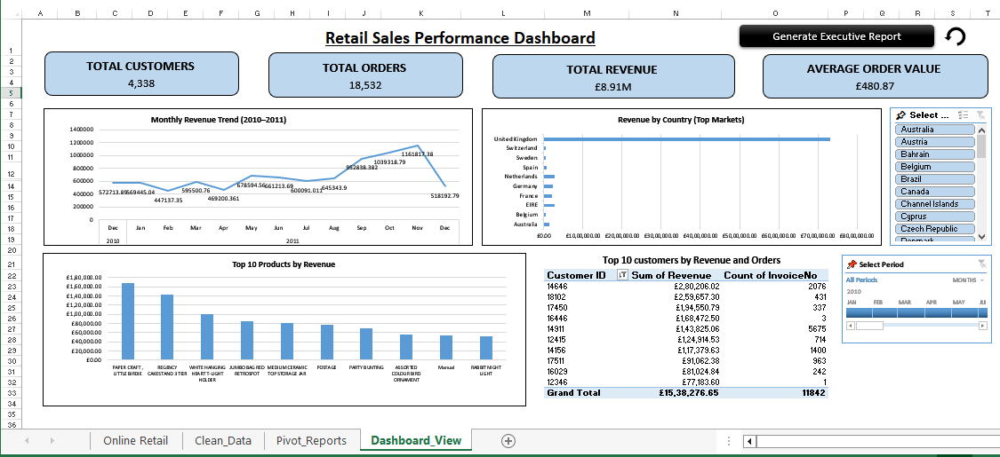
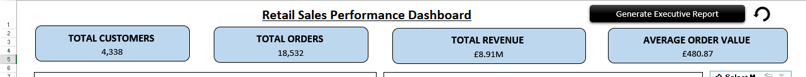
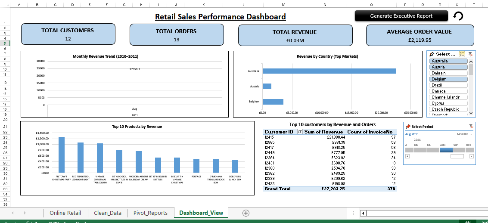
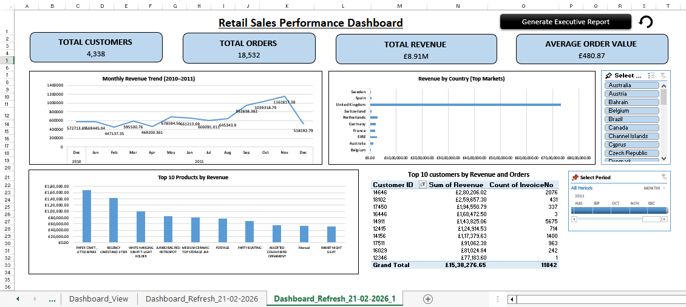
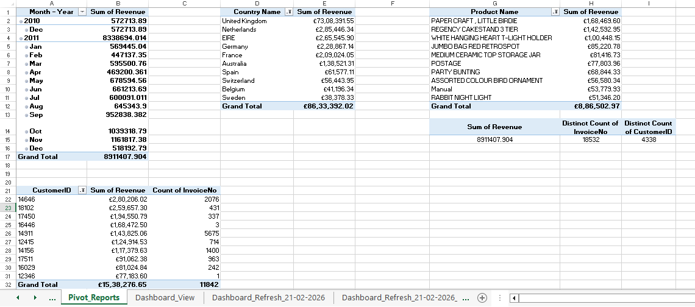

# 📊 Retail Sales Performance Dashboard (Excel + VBA)

## 🔍 Project Overview
This project simulates a real-world corporate Retail Sales MIS Dashboard built using Excel, PivotTables, Slicers, and VBA automation.

The dashboard provides interactive insights into revenue trends, top products, customer contribution, and market performance.

---

## 🛠 Tools & Skills Used
- Microsoft Excel (Advanced)
- Pivot Tables & Pivot Charts
- Slicers & Timeline Filters
- KPI Card Design (Shape-based)
- VBA Automation (Dashboard Snapshot Creation)
- Data Cleaning & Transformation

---
## 📂 Dataset Source

The dataset used in this project is publicly available from:

UCI Machine Learning Repository – Online Retail Dataset  
https://archive.ics.uci.edu/dataset/352/online+retail

---
## 📈 Key Business Insights
- Revenue trend analysis (2010–2011)
- Top revenue-generating products
- Customer revenue contribution analysis
- Country-wise performance breakdown
- Interactive filtering by market and period

---

## ⚙️ Automation Feature
A VBA macro allows:
- One-click dashboard snapshot generation
- Auto-renamed historical dashboard versions
- Formula freezing for reporting archives

---

## 📷 Dashboard Preview

### 🔹 Full Executive Dashboard

### 🔹 KPI Section

### 🔹 Interactive Filtering (Slicers + Timeline)

### 🔹 VBA Snapshot Automation

### 🔹 Pivot Reporting Backend (Data Modeling Layer)

---

## 👩‍💻 Author
Jahnavi  
Aspiring Data Analyst | SQL • Excel • Power BI • Python
